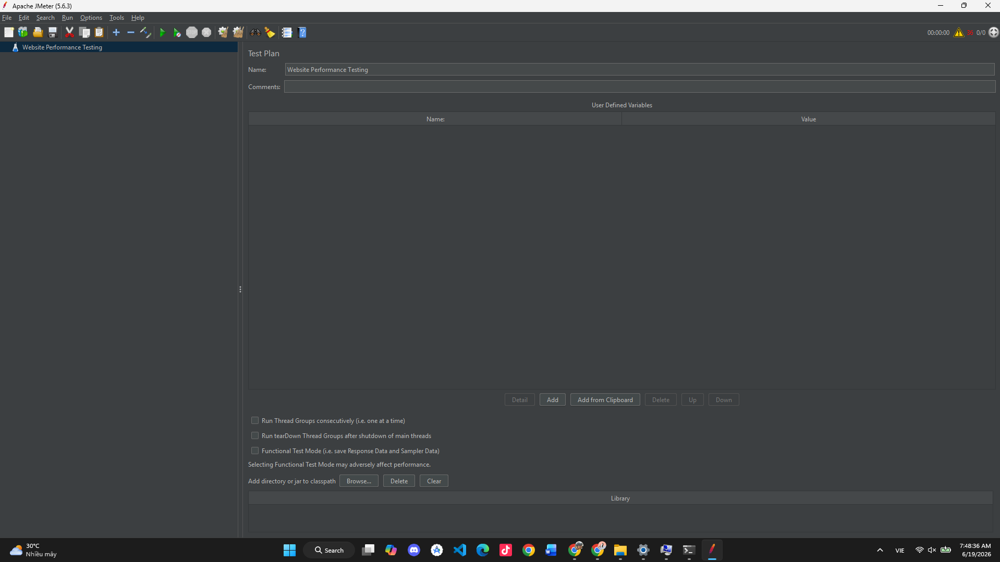
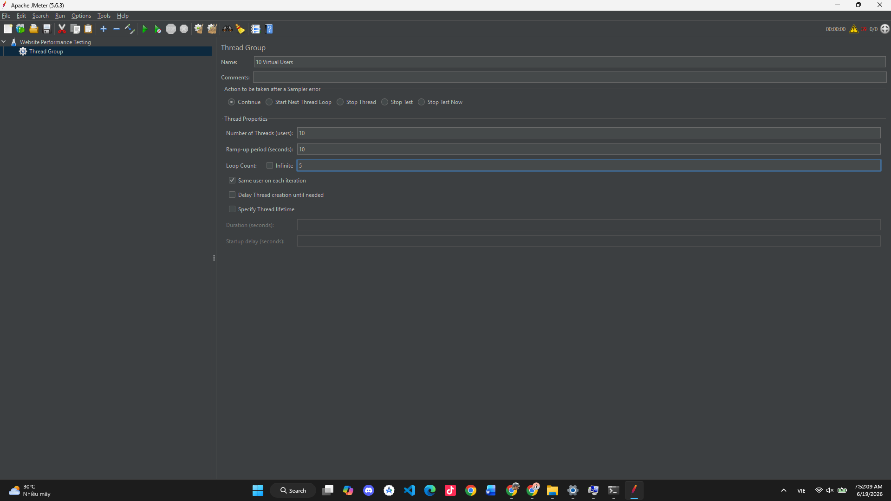
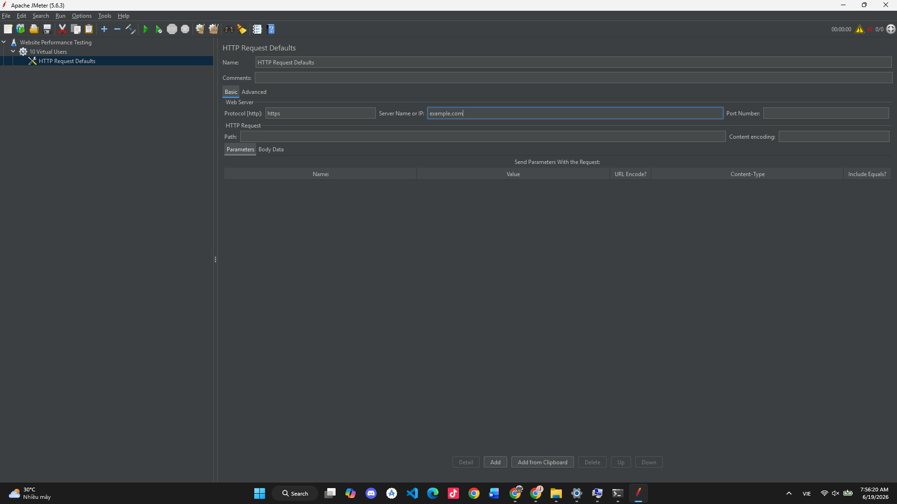
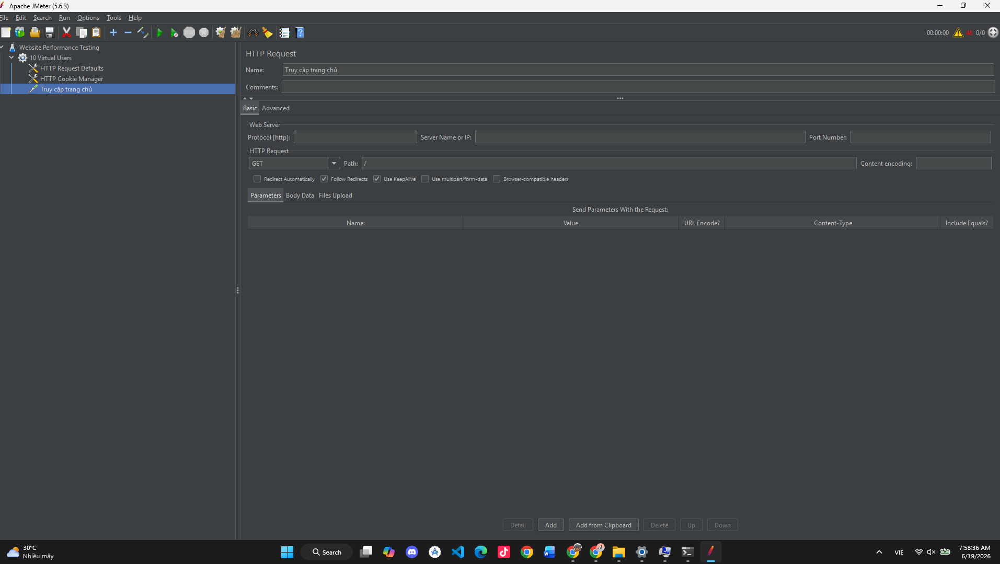
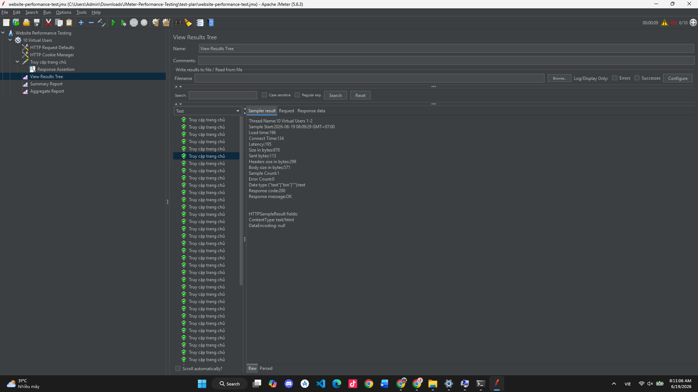
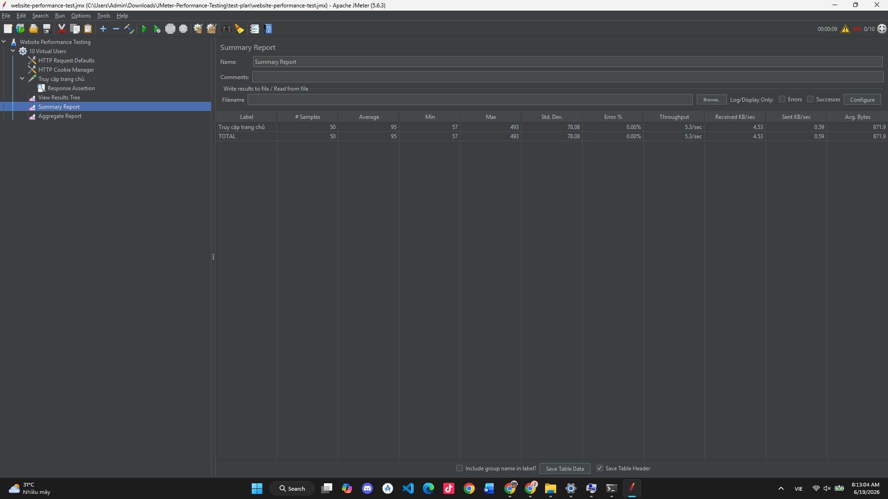
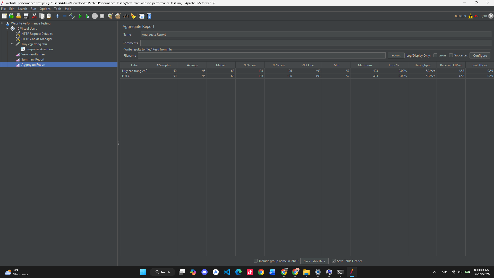
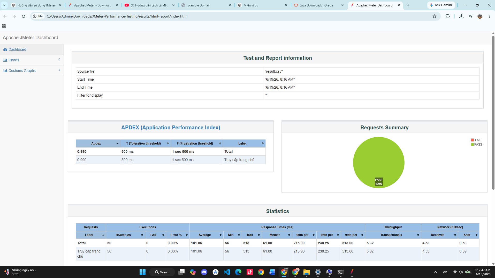

# BÁO CÁO THỰC HÀNH KIỂM THỬ HIỆU NĂNG BẰNG APACHE JMETER

## 1. Thông tin sinh viên

* **Họ và tên:** Nguyễn Bá Huy
* **Mã sinh viên:** 23010806
* **Lớp:** K17-CNTT8
* **Môn học:** Đánh giá và kiểm định chất lượng phần mềm*-1-3-25(COUR01.LT5)
* **Công cụ sử dụng:** Apache JMeter 5.6.3
* **Tên repository:** testlab8
* **Link repository:** https://github.com/16yuji/testlab8

---

## 2. Giới thiệu Apache JMeter

Apache JMeter là một công cụ mã nguồn mở được phát triển bằng Java. Công cụ này thường được sử dụng để kiểm thử tải và đánh giá hiệu năng của website, REST API, cơ sở dữ liệu và một số dịch vụ mạng khác.

JMeter cho phép mô phỏng nhiều người dùng truy cập hệ thống cùng lúc, gửi các request và thu thập các chỉ số quan trọng như:

* Thời gian phản hồi trung bình.
* Thời gian phản hồi nhỏ nhất và lớn nhất.
* Tỷ lệ request bị lỗi.
* Số lượng request được xử lý.
* Throughput của hệ thống.
* Lượng dữ liệu gửi và nhận.

Trong bài thực hành này, JMeter được sử dụng để kiểm thử khả năng phản hồi của một website thông qua phương thức HTTP GET.

---

## 3. Mục tiêu thực hành

Bài thực hành được thực hiện với các mục tiêu:

* Cài đặt và khởi động Apache JMeter.
* Làm quen với giao diện JMeter.
* Tạo một Test Plan kiểm thử hiệu năng.
* Mô phỏng nhiều người dùng truy cập website.
* Tạo HTTP Request gửi đến máy chủ.
* Sử dụng Response Assertion để kiểm tra mã phản hồi.
* Theo dõi kết quả bằng View Results Tree.
* Phân tích kết quả bằng Summary Report và Aggregate Report.
* Xuất báo cáo kết quả dưới dạng HTML Dashboard.
* Lưu Test Plan dưới dạng file `.jmx`.
* Quản lý và nộp sản phẩm thông qua GitHub.

---

## 4. Môi trường thực hiện

| Thành phần       | Thông tin                          |
| ---------------- | ---------------------------------- |
| Hệ điều hành     | Windows 11                         |
| Java             | Java 26.0.1                        |
| Apache JMeter    | Phiên bản 5.6.3                    |
| Loại kiểm thử    | Performance Testing – Load Testing |
| Website kiểm thử | https://example.com                |
| Giao thức        | HTTPS                              |
| Phương thức      | GET                                |

---

## 5. Cài đặt và khởi động JMeter

### 5.1. Kiểm tra Java

Trước khi sử dụng JMeter, mở Command Prompt và chạy lệnh:

```bash
java -version
```

Kết quả trên máy thực hiện:

```text
java version "26.0.1"
Java(TM) SE Runtime Environment
Java HotSpot(TM) 64-Bit Server VM
```

Kết quả trên cho thấy Java đã được cài đặt và có thể sử dụng để chạy Apache JMeter.

### 5.2. Khởi động Apache JMeter

Thư mục Apache JMeter được lưu tại:

```text
C:\Users\Admin\Downloads\apache-jmeter-5.6.3
```

Truy cập thư mục:

```text
C:\Users\Admin\Downloads\apache-jmeter-5.6.3\bin
```

Sau đó chạy file:

```text
jmeter.bat
```

JMeter được khởi động thành công và hiển thị giao diện tạo Test Plan.

---

## 6. Tạo Test Plan

Test Plan được đặt tên là:

```text
Website Performance Testing
```

Test Plan là thành phần chính chứa toàn bộ cấu hình và kịch bản kiểm thử.

Cấu trúc Test Plan:

```text
Website Performance Testing
└── 10 Virtual Users
    ├── HTTP Request Defaults
    ├── HTTP Cookie Manager
    ├── Truy cập trang chủ
    │   └── Response Assertion
    ├── View Results Tree
    ├── Summary Report
    └── Aggregate Report
```

Hình ảnh giao diện Test Plan:



---

## 7. Cấu hình Thread Group

Thread Group được sử dụng để xác định số lượng người dùng ảo, thời gian khởi tạo người dùng và số lần thực hiện kịch bản.

Thread Group được đặt tên là:

```text
10 Virtual Users
```

Các thông số được cấu hình:

| Thuộc tính                | Giá trị |
| ------------------------- | ------: |
| Number of Threads (users) |      10 |
| Ramp-up Period            | 10 giây |
| Loop Count                |       5 |

Ý nghĩa:

* **Number of Threads:** Mô phỏng 10 người dùng ảo.
* **Ramp-up Period:** JMeter khởi tạo đủ 10 người dùng trong vòng 10 giây.
* **Loop Count:** Mỗi người dùng thực hiện kịch bản 5 lần.

Tổng số request dự kiến:

```text
10 người dùng × 5 lần lặp = 50 request
```

Hình ảnh cấu hình Thread Group:



---

## 8. Cấu hình HTTP Request Defaults

HTTP Request Defaults được sử dụng để khai báo các thông tin máy chủ dùng chung cho những HTTP Request bên trong Thread Group.

Thông số cấu hình:

| Thuộc tính        | Giá trị     |
| ----------------- | ----------- |
| Protocol          | https       |
| Server Name or IP | example.com |

Việc sử dụng HTTP Request Defaults giúp không phải nhập lại giao thức và địa chỉ máy chủ trong từng HTTP Request.

Hình ảnh cấu hình:



---

## 9. Cấu hình HTTP Cookie Manager

HTTP Cookie Manager được thêm vào Thread Group để lưu trữ và quản lý cookie của từng người dùng ảo.

Trong bài thực hành, HTTP Cookie Manager được giữ nguyên cấu hình mặc định.

Thành phần này giúp JMeter mô phỏng cách trình duyệt lưu và gửi cookie khi người dùng truy cập website.

---

## 10. Cấu hình HTTP Request

HTTP Request được đặt tên là:

```text
Truy cập trang chủ
```

Thông số cấu hình:

| Thuộc tính  | Giá trị                          |
| ----------- | -------------------------------- |
| Method      | GET                              |
| Path        | /                                |
| Protocol    | Kế thừa từ HTTP Request Defaults |
| Server Name | Kế thừa từ HTTP Request Defaults |

Request này mô phỏng hành động người dùng truy cập trang chủ của website:

```text
https://example.com/
```

Hình ảnh cấu hình HTTP Request:



---

## 11. Cấu hình Response Assertion

Response Assertion được thêm vào HTTP Request để kiểm tra mã phản hồi trả về từ máy chủ.

Thông số cấu hình:

| Thuộc tính             | Giá trị          |
| ---------------------- | ---------------- |
| Apply to               | Main sample only |
| Field to Test          | Response Code    |
| Pattern Matching Rules | Equals           |
| Pattern to Test        | 200              |

Ý nghĩa của cấu hình:

* Nếu máy chủ trả về mã `200`, request được xem là thành công.
* Nếu máy chủ trả về mã khác `200`, request sẽ được JMeter đánh dấu là lỗi.
* Response Assertion giúp xác minh kết quả thay vì chỉ gửi request mà không kiểm tra phản hồi.

---

## 12. Thực hiện kiểm thử

Sau khi cấu hình hoàn tất, Test Plan được lưu với tên:

```text
website-performance-test.jmx
```

Đường dẫn trong repository:

```text
test-plan/website-performance-test.jmx
```

Bài kiểm thử được chạy bằng nút **Start** trên thanh công cụ của JMeter.

JMeter thực hiện:

```text
10 người dùng ảo × 5 lần lặp = 50 request
```

---

## 13. Kết quả View Results Tree

View Results Tree hiển thị kết quả chi tiết của từng request.

Kết quả quan sát được:

```text
Response code: 200
Response message: OK
Error Count: 0
Content-Type: text/html
```

Các request đều xuất hiện với biểu tượng màu xanh, cho thấy request đã được thực hiện thành công.

Hình ảnh kết quả View Results Tree:



### Nhận xét

* Máy chủ trả về mã phản hồi `200`.
* Response Message là `OK`.
* Không có lỗi trong quá trình gửi request.
* Response Assertion hoạt động đúng.
* Dữ liệu phản hồi có định dạng HTML.

---

## 14. Kết quả Summary Report

Summary Report cung cấp các thông tin tổng hợp về toàn bộ quá trình kiểm thử.

Hình ảnh kết quả:



Các chỉ số quan trọng:

| Chỉ số          | Ý nghĩa                                          |
| --------------- | ------------------------------------------------ |
| Label           | Tên request                                      |
| # Samples       | Tổng số request đã thực hiện                     |
| Average         | Thời gian phản hồi trung bình                    |
| Min             | Thời gian phản hồi nhỏ nhất                      |
| Max             | Thời gian phản hồi lớn nhất                      |
| Std. Dev.       | Mức độ dao động của thời gian phản hồi           |
| Error %         | Tỷ lệ request bị lỗi                             |
| Throughput      | Số request được xử lý trong một đơn vị thời gian |
| Received KB/sec | Lượng dữ liệu nhận được mỗi giây                 |
| Sent KB/sec     | Lượng dữ liệu gửi đi mỗi giây                    |

Kết quả chính:

| Chỉ số                  |    Kết quả |
| ----------------------- | ---------: |
| Tổng số request dự kiến |         50 |
| Mã phản hồi             |        200 |
| Tỷ lệ lỗi               |      0.00% |
| Trạng thái              | Thành công |

Các số liệu về Average, Min, Max và Throughput có thể thay đổi theo tốc độ mạng và trạng thái máy chủ tại thời điểm kiểm thử.

---

## 15. Kết quả Aggregate Report

Aggregate Report cung cấp thêm các chỉ số chuyên sâu về thời gian phản hồi.

Hình ảnh kết quả:



Các chỉ số chính:

| Chỉ số     | Ý nghĩa                                                |
| ---------- | ------------------------------------------------------ |
| Average    | Thời gian phản hồi trung bình                          |
| Median     | Trung vị thời gian phản hồi                            |
| 90% Line   | 90% request có thời gian phản hồi thấp hơn giá trị này |
| 95% Line   | 95% request có thời gian phản hồi thấp hơn giá trị này |
| 99% Line   | 99% request có thời gian phản hồi thấp hơn giá trị này |
| Min        | Thời gian phản hồi nhỏ nhất                            |
| Max        | Thời gian phản hồi lớn nhất                            |
| Error %    | Tỷ lệ request thất bại                                 |
| Throughput | Khả năng xử lý request của hệ thống                    |

Kết quả cho thấy các request được thực hiện thành công và không xuất hiện lỗi trong quá trình kiểm thử.

---

## 16. Xuất báo cáo HTML Dashboard

Ngoài việc xem kết quả trực tiếp trong giao diện JMeter, kết quả kiểm thử còn được xuất thành báo cáo HTML Dashboard.

Lệnh chạy Test Plan bằng Command Prompt:

```bash
jmeter -n -t test-plan/website-performance-test.jmx -l results/result.csv
```

Trong đó:

* `-n`: Chạy JMeter ở chế độ không sử dụng giao diện.
* `-t`: Chỉ định file Test Plan.
* `-l`: Chỉ định file lưu kết quả kiểm thử.

Lệnh tạo báo cáo HTML:

```bash
jmeter -g results/result.csv -o results/html-report
```

Sau khi tạo thành công, mở file:

```text
results/html-report/index.html
```

Hình ảnh HTML Dashboard:



Báo cáo HTML cung cấp các thông tin:

* Tổng số request.
* Tỷ lệ request thành công và thất bại.
* Thời gian phản hồi trung bình.
* APDEX.
* Throughput.
* Response Times Over Time.
* Response Time Percentiles.
* Requests Summary.

---

## 17. Đánh giá kết quả

Qua quá trình kiểm thử, có thể nhận xét:

* JMeter đã gửi request theo đúng cấu hình.
* Hệ thống đã mô phỏng 10 người dùng ảo.
* Mỗi người dùng thực hiện 5 vòng lặp.
* Tổng số request dự kiến là 50.
* Các request đều nhận được mã phản hồi `200`.
* Response Assertion không phát hiện lỗi.
* Tỷ lệ lỗi là `0.00%`.
* Website phản hồi bình thường với mức tải nhỏ.

Kết quả này chỉ phản ánh khả năng phản hồi của hệ thống trong phạm vi bài thực hành.

Để đánh giá đầy đủ hơn, có thể thực hiện thêm các kịch bản:

* Tăng số người dùng lên 50 hoặc 100.
* Thay đổi Ramp-up Period.
* Kiểm thử nhiều trang khác nhau.
* Kiểm thử REST API.
* Kiểm thử phương thức POST.
* Thực hiện Stress Testing.
* Thực hiện Spike Testing.
* Thực hiện Endurance Testing.

---

## 18. Kiến thức đạt được

Sau bài thực hành, em đã:

* Biết cách cài đặt và khởi động Apache JMeter.
* Hiểu vai trò của Test Plan.
* Biết cách tạo và cấu hình Thread Group.
* Biết cách mô phỏng người dùng ảo.
* Biết cách cấu hình HTTP Request Defaults.
* Biết cách tạo HTTP Request.
* Biết cách sử dụng HTTP Cookie Manager.
* Biết cách sử dụng Response Assertion.
* Biết cách đọc kết quả trong View Results Tree.
* Biết cách phân tích Summary Report.
* Biết cách phân tích Aggregate Report.
* Biết cách xuất báo cáo HTML Dashboard.
* Biết cách lưu kịch bản kiểm thử dưới dạng file `.jmx`.
* Biết cách quản lý và nộp bài thông qua GitHub.

---

## 19. Hạn chế của bài thực hành

Bài thực hành vẫn còn một số hạn chế:

* Chỉ kiểm thử một website đơn giản.
* Chỉ sử dụng phương thức GET.
* Chỉ kiểm thử một đường dẫn.
* Số người dùng ảo còn thấp.
* Chưa thực hiện kiểm thử đăng nhập.
* Chưa sử dụng dữ liệu kiểm thử từ file CSV.
* Chưa thực hiện kiểm thử trong thời gian dài.
* Kết quả có thể phụ thuộc vào tốc độ mạng Internet.
* Website được kiểm thử không phải là hệ thống thực tế của dự án.

---

## 20. Kết luận

Apache JMeter là công cụ hữu ích để kiểm thử tải và đánh giá hiệu năng của website hoặc API.

Trong bài thực hành này, em đã xây dựng một Test Plan mô phỏng 10 người dùng ảo truy cập trang chủ của website. Mỗi người dùng thực hiện 5 lần truy cập, tạo ra tổng cộng khoảng 50 request.

Kết quả cho thấy các request đều nhận được mã phản hồi `200`, không xuất hiện lỗi và Response Assertion hoạt động đúng.

Thông qua bài thực hành, em đã hiểu được quy trình cơ bản để xây dựng, chạy, theo dõi và phân tích một kịch bản kiểm thử hiệu năng bằng Apache JMeter.

---

## 21. Cấu trúc Repository

```text
testlab8
├── README.md
├── test-plan
│   └── website-performance-test.jmx
├── results
│   ├── result.csv
│   └── html-report
└── images
    ├── 01-test-plan.png.png
    ├── 02-thread-group.png
    ├── 03-http-request-defaults.png
    ├── 04-http-request.png
    ├── 05-view-results-tree.png
    ├── 06-summary-report.png
    ├── 07-aggregate-report.png
    └── 08-html-dashboard.png
```

---

## 22. Hướng dẫn chạy lại Test Plan

### Chạy bằng giao diện JMeter

1. Mở Apache JMeter.
2. Chọn **File → Open**.
3. Mở file:

```text
test-plan/website-performance-test.jmx
```

4. Nhấn nút **Start**.
5. Xem kết quả tại:

   * View Results Tree.
   * Summary Report.
   * Aggregate Report.

### Chạy bằng Command Prompt

Di chuyển đến thư mục `bin` của JMeter:

```bash
cd /d C:\Users\Admin\Downloads\apache-jmeter-5.6.3\bin
```

Chạy Test Plan:

```bash
jmeter -n -t "C:\Users\Admin\Downloads\JMeter-Performance-Testing\test-plan\website-performance-test.jmx" -l "C:\Users\Admin\Downloads\JMeter-Performance-Testing\results\result.csv"
```

Tạo báo cáo HTML:

```bash
jmeter -g "C:\Users\Admin\Downloads\JMeter-Performance-Testing\results\result.csv" -o "C:\Users\Admin\Downloads\JMeter-Performance-Testing\results\html-report"
```

---

## 23. Tài liệu tham khảo

* Apache JMeter User Manual.
* Apache JMeter Component Reference.
* Apache JMeter Getting Started.
* Tài liệu môn Kiểm thử phần mềm.
* Các tài liệu hướng dẫn kiểm thử hiệu năng website bằng JMeter.
